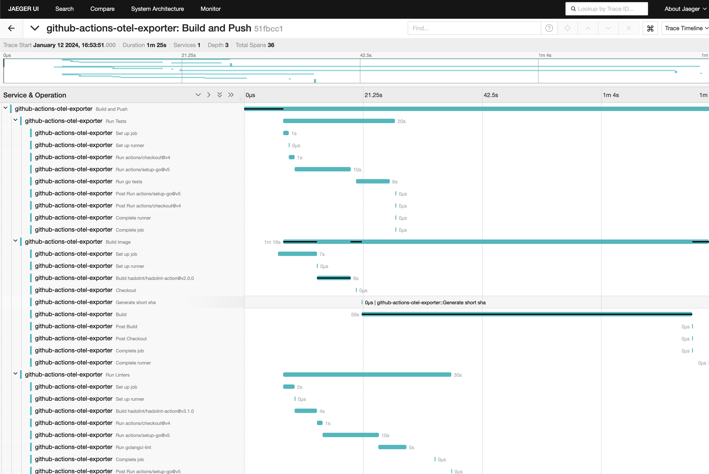
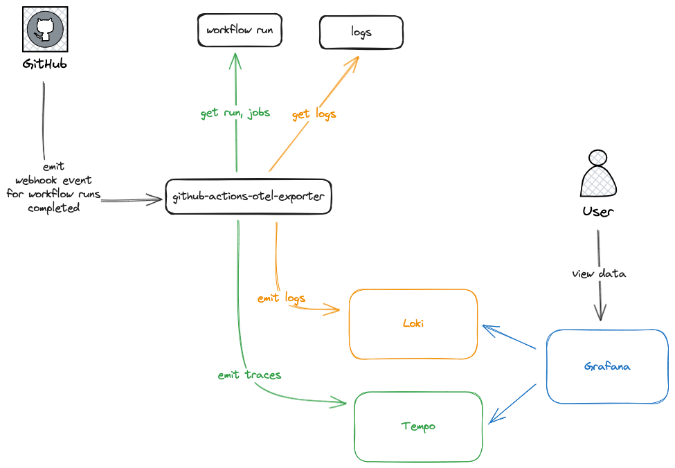

# github-actions-otel-exporter

This application allows you to emit OpenTelemetry traces to an OTEL-compatible tracing backend that measure the length of different steps within a GitHub Action pipeline.

## Usage

The application runs as a service to catch webhook events from GitHub. Specifically the events are the `workflow_run.completed` events. When the application receives an event, it will query the GitHub API for the workflow run and job details and emit telemetry to the configured OTEL backend with spans for each step in the workflow run.

To build:

```bash
go build -o github-actions-otel-exporter
```

To run:

```bash
# Start the backend
docker-compose up -d

# Run the service to receive traces
./github-actions-otel-exporter \
    --gha-pat {Your Github PAT}
```

Visit the Jaeger UI at [http://localhost:16686](http://localhost:16686) to see the traces.

* **NOTE**: The traces will use the timestamps of the actions workflow runs and jobs, so you may need to adjust query times to see the traces.

## Testing Locally

To test locally, I followed [this guide](https://docs.github.com/en/webhooks/testing-and-troubleshooting-webhooks/testing-webhooks#testing-webhook-code-locally) on delivering webhooks to a local application.

```bash
# Install smee-client
npm install --global smee-client

# Run the proxy locally - you will need to get your link from the smee.io website
smee --url https://smee.io/YOUR_UNIQUE_URL --path /webhook --port 8080

# Run the application with your own PAT
go run . --gha-pat YOUR_GITHUB_PATH
```

To trigger a webhook invocation, you can setup a workflow that emits events (see [this example](.github/workflows/hello-world.yaml) I've added to this repo) and then setup a repository webhook for a repo to send events to your https://smee.io URL.

## Inspiration

* Attribute mapping from https://github.com/inception-health/otel-export-trace-action
* Grafana "GraCIe" App https://grafana.com/blog/2023/11/20/ci-cd-observability-via-opentelemetry-at-grafana-labs/
* OTEL CI/CD Proposal https://github.com/open-telemetry/oteps/pull/223

### Jaeger UI Example



## Architecture

The following diagram describes a high level architecture for this application.



* A GitHub webhook is configured to deliver "workflow runs completed" events to the application
* The application receives the webhook and queries the GitHub API for the workflow run and job details
* The application emits a trace to the configured OTEL backend with spans for each step in the workflow run
* The application emits a log stream to a configured logging backend with the contents of the log files for each job in the workflow run

In the example above we are using [Grafana](https://github.com/grafana/grafana) as a visualization layer for the traces (stored in [Tempo](https://github.com/grafana/tempo)) and logs (stored in [Loki](https://github.com/grafana/loki)), but any OTEL-compatible backend can be used.
