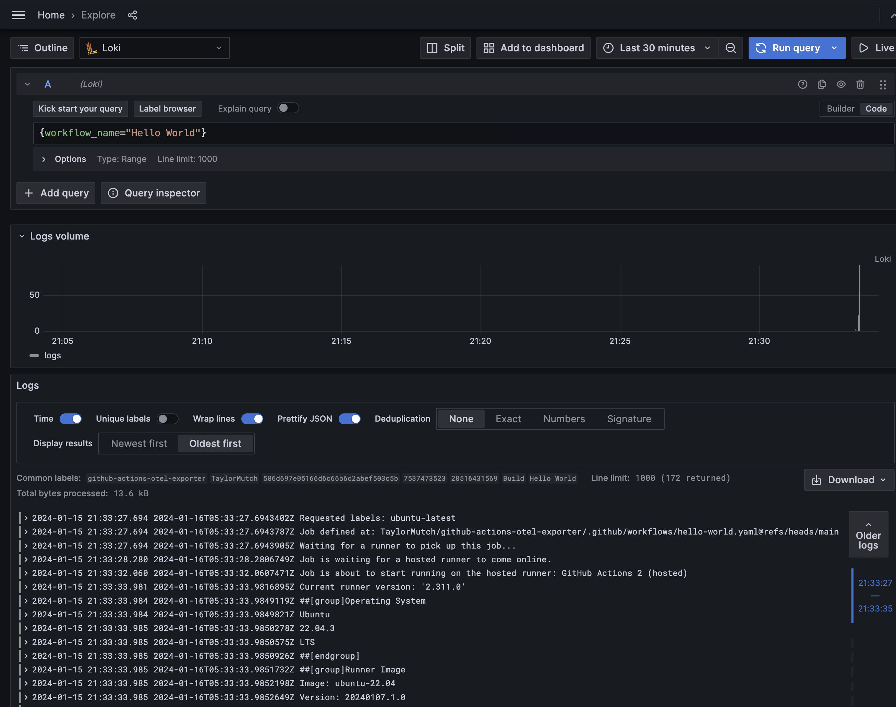
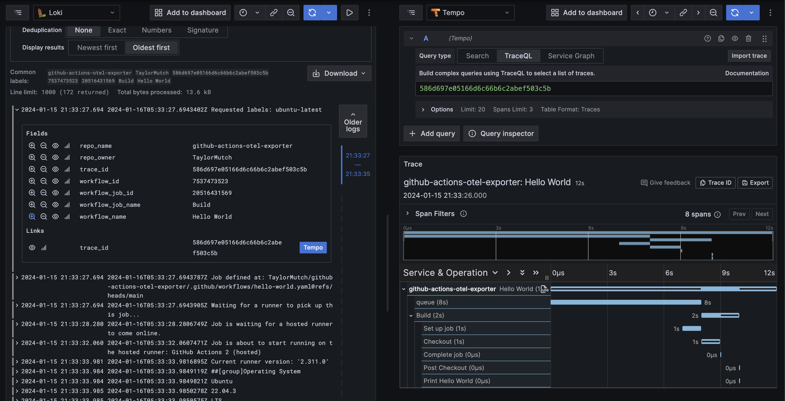
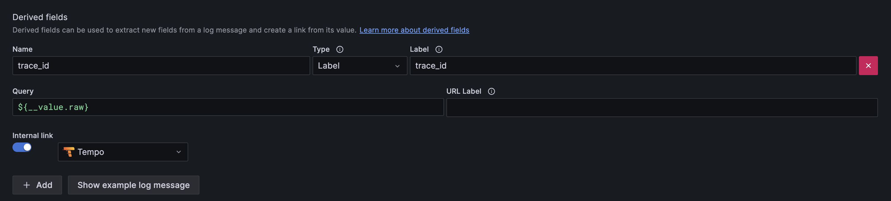
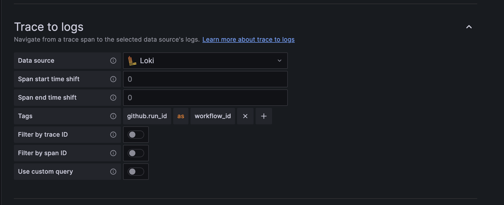

# github-actions-otel-exporter

This application allows you to emit OpenTelemetry traces to an OTEL-compatible tracing backend that measure the length of different steps within a GitHub Action pipeline.

Inspirations include:

* Attribute mapping from https://github.com/inception-health/otel-export-trace-action
* Grafana "GraCIe" App https://grafana.com/blog/2023/11/20/ci-cd-observability-via-opentelemetry-at-grafana-labs/
* OTEL CI/CD Proposal https://github.com/open-telemetry/oteps/pull/223

## Usage

The application runs as a service to catch webhook events from GitHub. Specifically the events are the `workflow_run.completed` events. When the application receives an event, it will query the GitHub API for the workflow run and job details and emit telemetry to the configured OTEL backend with spans for each step in the workflow run.

To build:

```bash
go build -o github-actions-otel-exporter
```

To run:

```bash
# Start the docker-compose stack
make up

# Run the service to emit telemetry
./github-actions-otel-exporter --gha-pat {Your Github PAT}
```

## Architecture

The following diagram describes a high level architecture for this application.


* A GitHub webhook is configured to deliver "workflow runs completed" events to the application
* The application receives the webhook and queries the GitHub API for the workflow run and job details
* The application emits a trace to the configured OTEL backend with spans for each step in the workflow run
* The application emits a log stream to a configured logging backend with the contents of the log files for each job in the workflow run

In the example above we are using [Grafana](https://github.com/grafana/grafana) as a visualization layer for the traces (stored in [Tempo](https://github.com/grafana/tempo)) and logs (stored in [Loki](https://github.com/grafana/loki)), but any OTEL-compatible backend can be used.

## Testing Locally

You will need a Github Personal Access Token (PAT) to run this application. I recommend using a [fine-grained access control token](https://docs.github.com/en/authentication/keeping-your-account-and-data-secure/managing-your-personal-access-tokens#creating-a-fine-grained-personal-access-token) that only has read-only access to your actions data. We do not need to edit any data.

To test webhooks locally, I followed [this guide](https://docs.github.com/en/webhooks/testing-and-troubleshooting-webhooks/testing-webhooks#testing-webhook-code-locally) on delivering webhooks to a local application.

```bash
# Install smee-client
npm install --global smee-client

# Run the proxy locally - you will need to get your link from the smee.io website
smee --url https://smee.io/YOUR_UNIQUE_URL --path /webhook --port 8081

# Run the application with your own PAT
GHA_PAT=${YOUR_GITHUB_PAT} go run .
```

Once you have a smee URL, you can start a smee client. I have added a `make smee` command to this repo's Makefile, which takes a `SMEE_URL` variable.

Next you need to configure a repo to send webhooks to your smee URL. I recommend setting up a test repo to trigger a workflow run where you configure a repo webhook (see the [docs on creating a repository webhook](https://docs.github.com/en/webhooks/using-webhooks/creating-webhooks#creating-a-repository-webhook)).

To trigger a webhook invocation, you can setup a workflow that emits events (see [this example](.github/workflows/hello-world.yaml) I've added to this repo).

One you have this all setup, you can setup the whole stack locally:

```bash
# Run docker-compose setup
make up

# Run the application from local build
make run GITHUB_PAT={Your Github PAT}
```

You should now see the server is started. From here you can trigger a workflow run in your test repo. Once it is completed, you should be able to see the telemetry and logs in Grafana.

## Viewing Data

Visit the Grafana locally at [http://localhost:3000](http://localhost:3000) (no login required) and select the "Loki" datasource. You can query for the logs from the workflow run using a [query similar to the following](http://localhost:3000/explore?schemaVersion=1&panes=%7B%22eMU%22:%7B%22datasource%22:%22loki-local%22,%22queries%22:%5B%7B%22refId%22:%22A%22,%22expr%22:%22%7Bworkflow_name%3D%5C%22Hello%20World%5C%22%7D%22,%22queryType%22:%22range%22,%22datasource%22:%7B%22type%22:%22loki%22,%22uid%22:%22loki-local%22%7D,%22editorMode%22:%22code%22%7D%5D,%22range%22:%7B%22from%22:%22now-30m%22,%22to%22:%22now%22%7D%7D%7D&orgId=1):

```
{workflow_name="Hello World"}
```

You should see something like the following:



From here, select any of the log lines and click the "Tempo" link to see the trace for that workflow run.



* **NOTE**: The traces and logs will use the timestamps of the actions workflow runs and jobs, so you may need to adjust query times to see the data.

Enjoy viewing your GitHub Actions telemetry!

### Grafana Loki and Tempo Configuration

**NOTE**: As of this writing (Jan 15, 2024) I am using Grafana 10.2.3, Tempo 2.3 and Loki 2.9.3.

To allow linking between logs and traces, we leverage the [traces to logs](https://grafana.com/docs/grafana/next/datasources/tempo/configure-tempo-data-source/#trace-to-logs) and "logs to traces" (aka [derived fields](https://grafana.com/docs/grafana/next/datasources/loki/configure-loki-data-source/#derived-fields)) features of Grafana Tempo and Loki. This requires a few configuration steps (see the below screenshots):

1. Configure the Loki datasource to use the Tempo datasource as a "logs to traces" correlation:



2. Configure the Tempo datasource to use the Loki datasource as a "traces to logs" correlation:



Once this is configured, you can use the internal links in the traces and logs to jump between the two different views.

### Jaeger UI Example

If you want to swap out Tempo/Grafana for simple Jaeger UI, the same thing works in Jaeger.


